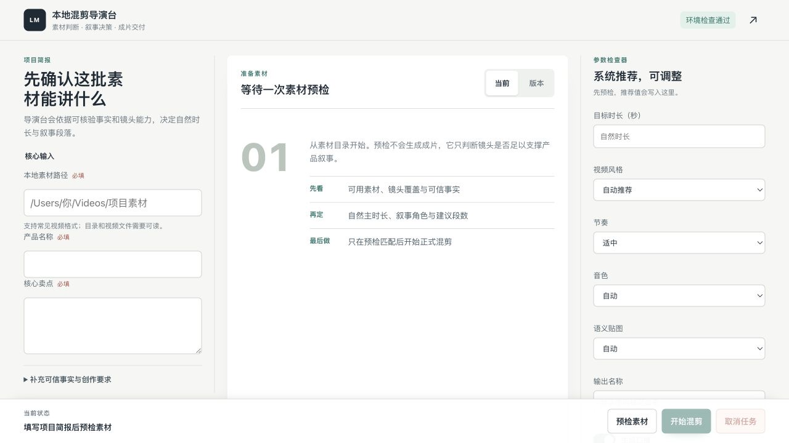

# Dy Ad Automation

[](https://www.python.org/)
[](https://ffmpeg.org/)
[](LICENSE)

面向抖音广告的一键成片工具。项目支持“本地视频混剪”和“可灵 AI 视频生成”两种互斥的画面来源，并共享脚本、单条口播、字幕、BGM、转场、语义贴图、调色、质量检测和最终导出链路。

## 目录

- [工作模式](#工作模式)
- [核心能力](#核心能力)
- [安装](#安装)
- [配置](#配置)
- [快速开始](#快速开始)
- [Web 工作台](#web-工作台)
- [本地素材证据合同](#本地素材证据合同)
- [时长规则](#时长规则)
- [输出产物](#输出产物)
- [项目结构](#项目结构)
- [测试](#测试)
- [故障排查](#故障排查)
- [文档](#文档)
- [License](#license)

## 工作模式

| 模式             | 画面来源                   | 核心流程                                             | 可灵图片/视频 API |
| ---------------- | -------------------------- | ---------------------------------------------------- | ----------------- |
| 本地视频混剪     | 用户提供的视频目录         | 素材理解 → 证据约束脚本 → 单条口播 → 智能选片 → 后期 | 不调用            |
| 可灵 AI 视频生成 | 产品信息、角色和商品参考图 | 广告脚本 → 视觉约束 → 分镜生成与择优 → 后期          | 调用              |

两种模式不会在同一次任务中混用画面生成链路。本地模式不会生成角色定妆照或估算可灵费用；AI 模式保留图片先行、分镜生成、候选择优和成本预估。

## 核心能力

- **证据驱动的本地混剪**：先理解完整素材，再根据可信产品事实和可见画面生成脚本，避免字幕与画面各自规划。
- **通用语义关联**：按“产品实体 → 素材实体 → 原料/产地/工艺/使用等证据角色”建立有边界的关联，不依赖单一品类或固定商品名。
- **连续口播与统一时间轴**：全视频只生成一条 TTS 母带，字幕、语义段和镜头共享同一时间轴权威。
- **非重复优先选片**：优先使用语义相关、容量充足且未重复的素材；不能完整覆盖时明确失败，不用无关画面凑时长。
- **证据约束贴图**：只突出原料、产地、工艺等有效信息；自动控制位置、展示时间和轻微动效，并避让主体与字幕安全区。
- **完整后期与质检**：支持 BGM、配音、字幕动画、转场、调色、SFX、封面、水印、合规检测和发布质量检测。
- **可审计反馈学习**：脚本和贴图规则只从使用者明确反馈中学习，不把自动评分或模型判断冒充用户偏好。

## 安装

前置条件：

- Python 3.10 或更高版本及 `pip`
- ffmpeg 4.0 或更高版本
- 与所选工作模式对应的 API 凭据

```bash
cd dy-ad-automation
pip install -r requirements.txt
```

安装 ffmpeg：

```bash
# macOS
brew install ffmpeg

# Ubuntu / Debian
sudo apt install ffmpeg
```

## 配置

复制环境变量模板：

```bash
cp .env.example .env
```

| 配置                                                                       | 使用场景                                 | 是否必需             |
| -------------------------------------------------------------------------- | ---------------------------------------- | -------------------- |
| `VISION_ENABLED=true`、`VISION_API_KEY`、`VISION_BASE_URL`、`VISION_MODEL` | 本地素材视觉理解，模型需支持 `image_url` | 本地素材模式必需     |
| `LLM_API_KEY`、`LLM_BASE_URL`、`LLM_MODEL`                                 | 主题解析和广告文案                       | 本地素材带货流程必需 |
| `KLING_ACCESS_KEY` + `KLING_SECRET_KEY`，或 `KLING_API_KEY`                | 可灵图片/视频生成                        | 可灵 AI 模式必需     |
| `VOLC_API_KEY`                                                             | 豆包 TTS 和可选火山 ASR                  | 可选                 |
| `ASR_PROVIDER`、`ASR_API_KEY`、`ASR_MODEL`                                 | 原素材人声转写                           | 素材有人声时按需配置 |

本地素材模式不需要可灵 Key。`--no-llm` 只适用于支持模板降级的非本地素材流程；本地素材带货流程会在没有 LLM 时阻断，避免生成无法验证的脚本。未配置豆包 TTS 时可降级到本机可用的 TTS。

完整环境变量说明见 [.env.example](.env.example)。

## 快速开始

### 本地视频混剪

```bash
python one_click_create.py --local-assets "/path/to/video-assets"
```

指定目标时长偏好：

```bash
python one_click_create.py \
  --local-assets "/path/to/video-assets" \
  --target-duration 30
```

交互运行也可以直接执行：

```bash
python one_click_create.py
```

按提示选择本地素材目录、输入产品主题和视频风格即可。带货风格会映射到更有能量的口播和相应节奏，但最终脚本仍受素材证据约束。

### 可灵 AI 视频生成

```bash
python one_click_create.py \
  --product-image "/path/to/product.png" \
  --style auto \
  --mode pro
```

未提供商品参考图时，发布级流程会阻断；仅调试或非商品视频可显式使用 `--allow-no-product-image`。

### 常用命令

```bash
# 查看全部参数
python one_click_create.py --help

# 快速预览第一段，保留完整后期效果
python one_click_create.py --preview

# 自动启用或关闭语义贴图
python one_click_create.py --stickers auto

# 同时导出 9:16 和 16:9
python one_click_create.py --dual-output

# 查看可用电影风格
python one_click_create.py --list-styles
```

完整参数和默认值见 [CLI 参考](docs/cli-reference.md)。

## Web 工作台

本地素材混剪也可以通过浏览器里的本地导演台运行：



> 从项目简报开始，让素材预检先回答“这批素材能讲什么”，再确认系统推荐并生成成片。

```bash
python local_web.py
```

启动后打开终端输出的本地地址，默认尝试使用 `http://127.0.0.1:8765`；如果端口已被占用，程序会自动选择其他可用端口。

导演台由项目简报、导演主舞台和参数检查器组成。素材预检会展示素材源、分析窗口、可用覆盖、自然主时长、叙事角色及风险缺口，并将推荐参数写入检查器供确认或调整。正式混剪期间可查看六阶段进度、原始日志并取消任务；完成后可预览成片，在“版本”视图查看最近产物。

工作台仅绑定本机回环地址，不对局域网或公网提供服务。可灵 AI 视频生成及高级参数仍使用 CLI。

## 本地素材证据合同

本地模式先建立统一的 Material Copy Contract，再让脚本校验和选片共享同一份证据：

1. 素材理解只把连续、清晰、可独立承载字幕主张的 `primary_visuals` 暴露给文案模型。
2. 产品名称只证明商品身份；原料、产地、工艺、规格和功效等具体主张必须来自可信产品资料或与产品实体相关的素材证据。
3. 产品包装文字与素材主体可以形成有边界的关联。例如包装标注某种原料且素材清晰出现对应实体，可作为原料情境；对应种植园、农场或山地环境可作为产地情境，但不能继续推导具体地点、品质或功效。
4. 有可信事实或真实使用结果的段落可承担 `value`；只有素材情境、缺少购买理由的段落承担 `proof`，避免把画面描述冒充带货卖点。
5. 文案视觉主张、Evidence Anchor、素材角色和候选镜头必须语义一致。预检失败会阻断导出，不会用无关画面兜底。

详细流程、关联边界和反馈学习见 [本地素材工作流](docs/local-assets.md)。

## 时长规则

本地素材模式有两种互不混用的时间轴权威：

- **未传 `--target-duration`**：由素材覆盖、去重后的可剪辑容量和单条 TTS 自然时长共同决定成片时长。
- **显式传入 `--target-duration`**：将指定时长作为规划偏好，扩展叙事段数和选片容量；素材不足时不会拉伸、循环或伪造画面，因此成片可能短于目标值。

可灵 AI 模式下，`--target-duration` 用于选择并适配节奏模板，同时仍受单片段生成时长与后期变速能力约束。

## 输出产物

```text
output/
├── character_ref/                 # 可灵模式角色参考资产
├── clips/                         # 选中片段及必要的调试资产
├── final/
│   ├── {product}_{run_id}_final.mp4
│   ├── {product}_{run_id}_16x9_final.mp4
│   ├── {product}_{run_id}_cover.jpg
│   ├── {product}_{run_id}_发布文案.txt
│   ├── {product}_{run_id}_final.script.json
│   └── {product}_{run_id}_run_manifest.json
├── bgm_cache/
└── sfx_cache/
```

成功导出后会删除 `final/` 中的拼接、配音、字幕和调色等临时渲染文件，同时保留最终成片、封面、发布文案和必要的审计 sidecar。失败任务会保留本次中间产物，控制台会打印排查目录。

## 项目结构

| 模块                         | 职责                                               |
| ---------------------------- | -------------------------------------------------- |
| `one_click_create.py`        | CLI、模式路由、时间轴权威和一键成片编排            |
| `local_asset_pipeline.py`    | 素材理解、证据合同、脚本约束、自然时间轴和智能选片 |
| `material_copy_optimizer.py` | 素材证据到带货文案的营销语义评估                   |
| `semantic_stickers.py`       | 证据约束的语义贴图规划和渲染                       |
| `kling_client.py`            | 可灵图片/视频 API 客户端                           |
| `video_merger.py`            | ffmpeg 拼接、字幕、音频、调色和导出                |
| `tts_client.py`              | 豆包 TTS 优先、本地 TTS 降级的口播生成             |
| `bgm_client.py`              | BGM 搜索、匹配、缓存和混音                         |
| `quality_checker.py`         | 清晰度、黑帧、冻结帧和音频等质量检测               |
| `compliance_checker.py`      | 广告合规检测和风险拦截                             |
| `batch.py`                   | YAML 批量任务和并发控制                            |

架构与两条执行链路见 [架构说明](docs/architecture.md)。

## 测试

```bash
python -m pytest tests/ -v
```

测试覆盖参数与风格配置、本地素材证据合同、时长权威、语义选片、文案营销功能、字幕/口播时间轴、语义贴图和主要后期逻辑。

## 故障排查

### 所有响应均未形成有效的完整 segments JSON

LLM 返回可能被截断、不是完整 JSON，或候选未满足语义合同。先检查服务稳定性和输出长度，再读取最后一条合同校验原因。不要删除校验或手工拼接残缺 JSON。

### Evidence Anchor 缺失或与文案无关

文案提出了具体产品主张，但产品资料和当前素材没有直接证据。补充真实产品信息，或提供能清晰展示对应实体的素材；产品名称不能单独证明具体卖点。

### 素材中有对应画面，但匹配容量为 0 秒

画面可能只在次要区域、持续时间不足、被判为重复，或脚本要求与素材理解结果不一致。检查失败任务保留的素材理解和时间轴审查产物，确认 `primary_visuals`、素材角色和可用时长。

### ffmpeg 或 API 调用失败

确认 ffmpeg 可执行、对应 API Key 有效、接口地址与模型能力匹配。更多诊断步骤见 [故障排查](docs/troubleshooting.md)。

## 文档

- [本地素材工作流](docs/local-assets.md)
- [可灵 AI 生成与后期](docs/ai-generation.md)
- [CLI 参数参考](docs/cli-reference.md)
- [批量任务与模板](docs/batch-and-templates.md)
- [架构说明](docs/architecture.md)
- [故障排查](docs/troubleshooting.md)
- [电影风格参考](references/cinematic_styles/)
- [更新日志](CHANGELOG.md)

## License

本项目采用 [MIT License](LICENSE)。
